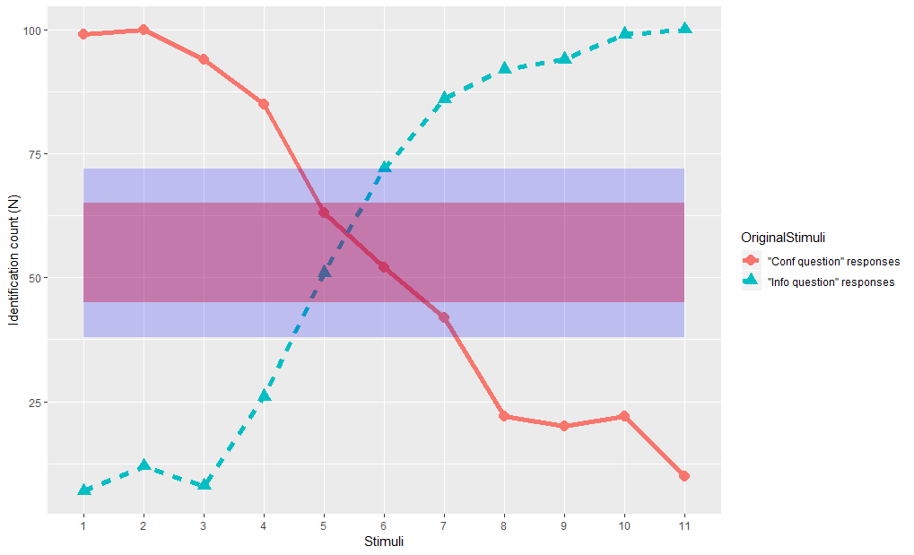

# Mark chance level for perceptual tests
Plots a line plot (classical categorical perception graph) with a red ribbon for chance level. For example, for 100 answers, from 47 to 53% of cases.

## Expected input 
A Excel file with the following format:

Stimuli | Answer | nAnswers
------------ | ------------- | -------------
1 (-0.88hz) | Statement | 64
1 (-0.88hz) | Question | 1
2 (4.5hz) | Statement | 0
2 (4.5hz) | Question | 65

## Output

